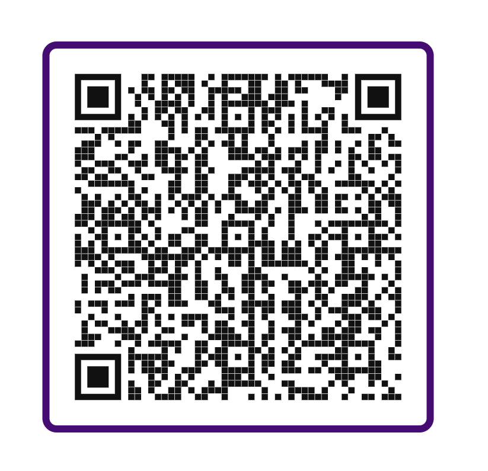

<h4 align="center">
📝 Focus Time 📝
</h4>
<!-- <div align="center">

  [](https://www.linkedin.com/in/kayo-renato/)

  [](https://github.com/KayoRenato)

  [](https://peerlist.io/kayoio)
</div> -->


<hr>

<p align="center">
  <a href="#dart-about">About</a> &#xa0; | &#xa0;
  <a href="#sparkles-features">Features</a> &#xa0; | &#xa0;
  <a href="#computer-technologies--requirements">Technologies & Requirements</a> &#xa0; | &#xa0;
  <a href="#clapper-show-off">Show Off</a> &#xa0; | &#xa0;
  <a href="#checkered_flag-starting">Starting</a> &#xa0; | &#xa0;
  <a href="#memo-license">License</a> &#xa0; | &#xa0;
  <a href="#gem-deploy--repository">Deploy & Repository</a> &#xa0; | &#xa0;
  <a href="https://github.com/KayoRenato" target="_blank">Author</a>
</p>

<br>

## :dart: About ##

The Focus Time application is a simple tool for managing your time and increasing your productivity. Using customized intervals of 5 minutes, the application helps you to work in focused sessions and keep track of your progress. It presents only three states: completed, in progress, and suspended.

The application aims to solve the problem of lack of focus and productivity during work sessions. By using a simple and customizable timer, it encourages users to work in focused sessions and take breaks to recharge their energy.

This project was created to practice fundamental concepts of React Hooks like useContext, useState, useEffect, useForm, useReducer, and Date Formatting. The main idea is to provide a simple and effective tool while improving React skills and learning how to use Hooks to manage state and form data.

## :sparkles: Features ##
:ballot_box_with_check: Customizable Timer: allows the user to set the timer duration in 5-minute intervals.
:ballot_box_with_check: Timer States: presents three timer states: completed, in progress, and suspended.
:ballot_box_with_check: Task Listing: displays a list of completed, suspended, or in-progress tasks.
:ballot_box_with_check: Responsive Design: the interface adapts to different screen sizes.
:ballot_box_with_check: Integration with React Hooks: the application uses fundamental concepts of React Hooks such as useContext, useState, useEffect, useForm, and useReducer.
:ballot_box_with_check: Integration with third-party libraries: the application uses various third-party libraries such as react-router-dom, styled-components, date-fns, phosphor-react, and react-hook-form.
:black_square_button:  Sound notifications: Adding sound notifications to the timer could be a helpful feature for users who want an audio cue when their timer is complete. Users could have the option to choose from different notification sounds or upload their own audio file.


## :computer: Technologies & Requirements ##

The following dependencies were used in this project:

- "date-fns": a library that provides various functions for formatting and manipulating dates and times in JavaScript.

- "phosphor-react": a library of SVG icons that can be used in React applications.

- "react": a JavaScript library for building user interfaces.

- "react-dom": a package that provides DOM-specific methods for React.

- "react-hook-form": a library for managing forms in React using hooks.

- "react-router-dom": a library that provides routing functionality for React applications.

- "styled-components": a library that enables developers to write CSS in JavaScript, making it easier to create and manage styled components in React.

## :clapper: Show Off ##


## :checkered_flag: Starting ##

Before starting :checkered_flag:, you need to have [Git](https://git-scm.com) and [Npm](https://www.npmjs.com/) installed.

```bash
# Clone this project
$ git clone git@github.com:KayoRenato/FocusTime.git <Project-Name> 


# Access
$ cd <Project-Name>

# Install dependencies
$ npm i

# Run the project
$ npm run dev

# The server will initialize in the <http://localhost:5173>
```

## :memo: License ##

This project is under license from MIT. For more details, see the [LICENSE](License.md) file.

## :gem: Deploy & Repository ##

<a href="https://focustime.kayoio.com/" target="_blank">:rocket: Link to solution deployed</a>

<a href="https://github.com/KayoRenato/FocusTime" target="_blank">:octopus: Link to repository</a>

<br>

Donate behind the QR code if this work helps you and you want to collaborate with a coffee :coffee:.
<div style='display: flex; justify-content: center;  flex-direction:column; align-items: center;'>
  
  <p style='font-size: 12px; font-weight:500; color: #8228D1; display: flex;  align-items: center;'>
   Nubank Pix</p>
</div>
---

<a href="#top">Back to top :arrow_heading_up:</a>
